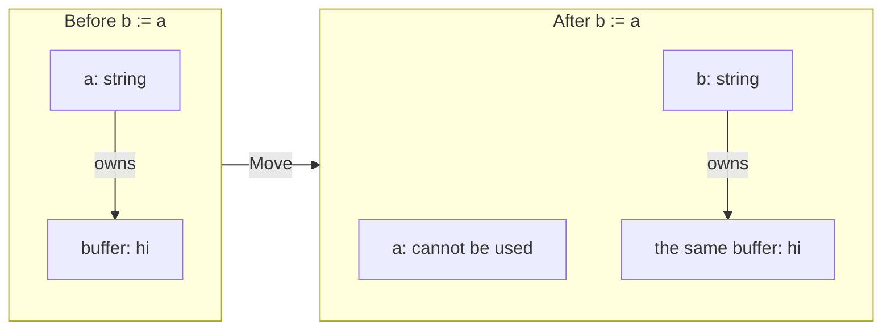
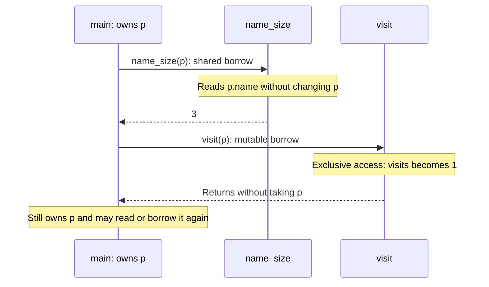
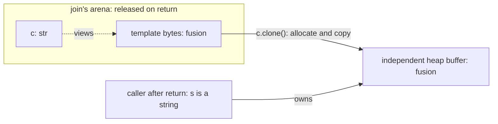

# Memory: value, arena, heap

> 🌐 **English** · [Japanese](./ja/05-memory.md)

Align has no garbage collector, no manual `free`, and no lifetime annotations. Instead: **where data lives is a decision you make**, ownership is **a property of the type**, and the compiler infers every lifetime and rejects the programs that would dangle. This chapter is the core of the model — it is small.

## Values (the default)

Most data is a plain value: a number, a `bool`, a small struct, a tuple of scalars. Values live on the stack and are **Copy** — assigning or passing one duplicates it, both copies are independent, nothing is ever freed because nothing was allocated.

```align
Point { x: f64, y: f64 }

fn main() -> i32 {
    p := Point { x: 1.0, y: 2.0 }
    q := p              // a copy; p and q are independent
    return 0
}                       // scope ends, values are simply gone
```

When a struct gets big, passing it by value starts to cost — the compiler warns (`huge struct copy`) past two cache lines. That is your cue to reach for a slice, an arena, or SoA (chapter [11](11-data-oriented.md)) instead of copying.

## Move types — ownership in the type

Types that own heap resources — `string`, `array<T>`, `buffer`, `box`, I/O handles — are **Move**, not Copy. Assigning one transfers ownership; the source binding is dead afterwards, and the compiler enforces it:

```align
fn main() -> i32 {
    a := "hi".clone()   // a `string` — an owned heap buffer
    b := a              // ownership moves to b
    print(a.len())      // error: use of moved value 'a'
    return 0
}
```

Moving a value leaves one owner, so the compiler can determine when to release its resources. When the owner goes out of scope, the buffer is dropped; when you reassign a `mut` owner, the old value is dropped first. For types that support cloning, such as `string`, `.clone()` makes a second independent copy. A Move resource is not necessarily cloneable.

A struct with an owning field (`name: string`) becomes a Move type itself, dropped recursively — ownership composes through structure. Reading such a field (`u.name.len()`) borrows it as a `str` view without consuming anything.

The two panels show the same buffer before and after `b := a`. The string's bytes stay in place; ownership changes hands.



`b` now determines when the buffer is released. For `b := a.clone()` instead, there would be two independent buffers and both bindings would remain usable.

## Passing ownership, borrowing, and updating

A parameter of type `Profile` takes a Move `Profile` from its caller. Use `borrow` when the function should inspect the existing record, and `borrow mut` when it should update that record:

```align
Profile { name: string, visits: i64 }

fn name_size(borrow p: Profile) -> i64 = p.name.len()

fn visit(borrow mut p: Profile) {
    p.visits = p.visits + 1
}

fn main() -> i32 {
    mut p := Profile { name: "Ada".clone(), visits: 0 }
    print(name_size(p))    // 3
    visit(p)
    print(p.visits)        // 1
    print(p.name.len())    // 3 — p is still owned here
    return 0
}
```

The mode is written in the function declaration; the call remains `visit(p)`. A shared borrow cannot move, replace, or drop `p`. A mutable borrow requires a writable place and gives the callee exclusive access for the call. It also invalidates older views into that value: obtain a new view after an update rather than using one saved before it.

For a function that only needs text or array elements, prefer `str` or `slice<T>` to borrowing the whole record. Shared `borrow` is also useful for large Copy structs: ordinary value passing copies them, while a borrow reads the caller's existing value. `borrow mut` is needed when a Copy struct's field updates should reach the caller.

Follow the two calls in the example. Neither transfers ownership of `p`:



These calls return an integer and Unit. A function that returns a view can leave the caller with a reference into `p`; that view remains subject to `p`'s lifetime and mutation rules.

## Arenas — batch allocation by lifetime

When a *phase* of work allocates many things that all die together — parse a file, build a request, decode a batch — wrap the phase in `arena {}`:

```align
fn join(a: str, b: str) -> string {
    arena {
        c := template "{a}{b}" // arena-backed temporary
        return c.clone()    // copy the result out — visible escape
    }                       // all arena storage released here
}

fn main() -> i32 {
    s := join("fu", "sion")
    print(s)                // fusion
    return 0
}
```

Here `c` is a view of the template's arena storage. `c.clone()` allocates independent string storage and copies the bytes before `join` returns:



After the return, the arena storage is gone, but `s` owns the copied buffer. Dropping `s` releases that buffer. Returning `c` itself would leave the caller referring to the released arena storage, so the compiler rejects it. An independent scalar such as `c.len()` can leave without a copy of the text.

An arena normally allocates by advancing a pointer within a block, obtaining another block when needed. Leaving the arena releases its blocks together. It avoids individually freeing each temporary; constructing the values and obtaining or releasing the backing blocks still take work.

The compiler tracks the **region** of every value. A value allocated in an arena cannot leave it:

```align
fn leak(a: str, b: str) -> str {
    arena {
        s := template "{a}{b}"
        return s        // error: cannot return a value allocated in an arena
    }                   //        (it is freed at block end)
}
```

Region annotations are not part of the source syntax. The compiler reports an error if a reference would outlive its data. In the string example, `str.clone()` makes an independent owned string. This does not mean every arena value has a cloning operation: choose an owned result type and its allocation path when returning a collection.

In particular, `.to_array()` inside a local arena produces an arena-backed array, even though `array<T>` is a Move type. Move determines ownership transfer; the inferred region separately determines how long its storage may live. A helper with no local arena can allocate a free-standing result from borrowed inputs: the caller's arena is not implicitly inherited. [Little Aligner 15, Q19](../little-aligner/15-read-it-four-ways.md) shows the full pattern for an array of scores. Its `i64` elements are independent values; an owned array of `str` views would still depend on the storage those views borrow.

## The heap, explicitly

`heap.new(x)` makes a single explicit allocation — a `box` — inside the enclosing arena; `.get()` reads the value back out:

```align
fn main() -> i32 {
    arena {
        b := heap.new(42)
        print(b.get())      // 42
    }
    return 0
}
```

You will rarely write this — and the compiler will tell you when you didn't need it. The example above actually earns a lint:

```text
warning: unnecessary heap allocation: this box is only ever read back with
         `.get()` and never escapes — use the value directly (a stack value
         suffices)
```

Use `heap.new` when a value must outlive the stack frame that computed it while remaining inside a chosen arena. For other cases, prefer values or arena-backed collections; the lint above identifies an unnecessary box.

## Views: `str` and `slice<T>`

A `str` is a borrowed view of string data; a `slice<T>` is a borrowed view of an array. Views are cheap Copy values (a pointer and a length), and they carry the **region of the data they point into** — a view of arena data can't escape the arena, a view of a struct's field can't outlive the struct. Same inference, same rule, no annotation.

```align
fn main() -> i32 {
    xs := [10, 20, 30, 40]
    s := xs[1..3]           // slice view: elements 1 and 2, no copy
    print(s.sum())          // 50
    return 0
}
```

## The decision procedure

That's all of it. When you create data, ask one question — *what is its lifetime?*

- Dies in this expression or scope → **a value**. Do nothing.
- A batch that dies together at the end of a phase → **arena**, and `.clone()` the survivors out.
- One value that must outlive the frame → **`heap.new`** in the arena that matches its lifetime.
- Reading existing data → **a view** (`str`, `slice`), with no allocation or copy of the underlying data.

Everything else — when to free, whether it escapes, who owns what — is the compiler's job, checked at compile time, invisible in the source except at a few visible points: `arena {}` (or a named `arena r {}`) where a lifetime begins and ends, `.clone()` where you pay for a copy, and a `borrow` / `borrow mut` parameter where a function reads or updates a value it does not own.
