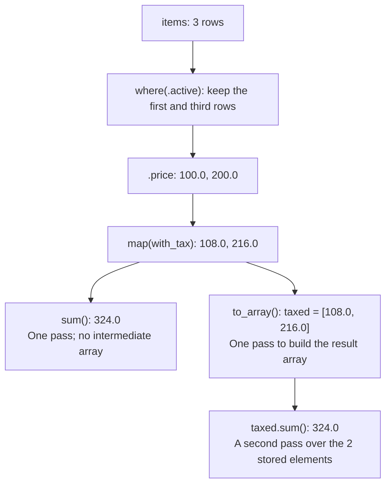

# Pipelines: the data-processing core

> 🌐 **English** · [Japanese](./ja/06-pipelines.md)

This is the heart of Align. You don't write loops; you describe a transformation over a collection, stage by stage, and the compiler generates the loop — fused into a single pass, branch-minimal, vectorizable. This chapter is the full vocabulary.

## The shape

```align
total := prices.map(with_tax).where(in_stock).sum()
```

Read left to right: transform each price, keep the values that pass the predicate, and add them. `map`, `where`, and `sum` fuse into one loop, passing each value straight to the next operation. **No intermediate arrays are created.**

A pipeline must **end** — in a reduction (`sum`, `count`, `reduce`, …) or a materialization (`to_array`, `map_into`). A dangling `xs.map(f)` with no terminal is a compile error, because a lazy value you can pass around would be a hidden cost.

> **Cost:** A fused reduction is O(n) and allocates no intermediate collection. `to_array` makes at most one result allocation (sized to the source upper bound when filtering); `map_into` writes caller-provided storage and allocates nothing.

## Transform stages

```align
xs.map(f)          // transform each element
xs.where(p)        // keep elements where p holds
xs.where(.active)  // field shorthand: keep rows whose bool field is true
xs.price           // field projection: array<Item> → the price of each
xs.scan(0, add)    // running accumulation — a stage, not a terminal
```

Functions passed to stages are named functions or inline lambdas — `fn x { x * 2 }`, with the parameter before the brace. (Lambdas capture surrounding values too; the full story is chapter [10](10-closures-and-parallelism.md).)

## Multiple sources with `zip`

Use `zip` when one output element depends on the same index of two or more arrays/slices:

```align
fn combine(a: slice<f32>, b: slice<f32>, c: slice<f32>, out dst: slice<f32>) {
    zip(a, b, c)
        .map(fn v { v.0 + v.1 * v.2 })
        .map_into(dst)
}
```

`zip` is a lazy pipeline head, not an array of tuples. All sources must have equal length (checked
before iteration), and each `v` is an ephemeral SSA tuple for one increasing index. The first
version accepts two or more Copy primitive-scalar arrays/slices. Sources may alias one another;
`map_into` still requires its destination to be disjoint from every source.

## Reduction terminals

```align
xs.sum()                              // add everything
xs.count()                            // how many survived the stages
xs.min()   /  xs.max()                // extrema
xs.any(p)  /  xs.all(p)               // bool: does any / do all satisfy p
xs.reduce(init, f)                    // the general fold — init FIRST, then fn acc, x
```

```align
fn main() -> i32 {
    xs := [1, 2, 3, 4]
    print(xs.reduce(1, fn acc, x { acc * x }))       // 24 — product
    print(xs.scan(0, fn acc, x { acc + x }).max())   // 10 — max prefix sum
    print(xs.map(fn x { x * x }).sum())              // 30
    return 0
}
```

## Reordering and splitting

```align
fn main() -> i32 {
    xs := [10, 21, 32, 3]
    sorted := xs.sort_by_key(fn x { -x })            // descending: negate the key
    print(sorted[0])                                 // 32

    (evens, odds) := [1, 2, 3, 4, 5].partition(fn x { x % 2 == 0 })
    print(evens.count())                             // 2
    print(odds.sum())                                // 9
    return 0
}
```

`sort()` sorts ascending; `sort_by_key(f)` sorts by a computed key. `partition(p)` splits one pass into two owned arrays: satisfying, then rest.

Both sorts are scalar-only for now, which is the pitfall on an `array<Item>` of structs: `sort` and `sort_by_key` over struct elements are rejected outright (`'sort' over struct elements is not supported yet (project a field first)`), and a `sort_by_key` key must be an orderable scalar — an int, a float, a `char`, or a `str`. Project the field you want to order by first.

> **Cost:** Both sorts are stable, have O(n log n) worst-case time, and materialize an owned result. Additional working storage is O(n) in the worst case. `sort_by_key` evaluates its key function exactly once per element, in input order. The current merge strategy may change without changing these guarantees.

## Chunking

`chunks(n)` yields consecutive windows as slices (the last may be shorter) — the batch-processing shape:

```align
fn per_chunk(xs: slice<i64>) -> i64 = xs.sum()

fn main() -> i32 {
    xs := [1, 2, 3, 4, 5]
    sums := xs.chunks(2).map(per_chunk).to_array()   // [3, 7, 5]
    print(sums.sum())                                // 15
    return 0
}
```

## Materializing: `to_array` and `map_into`

Most pipelines end in a reduction and never allocate. When you *do* want the transformed collection, say so explicitly:

```align
big := xs.map(fn x { x * 10 }).where(fn x { x > 20 }).to_array()   // owned array<i64>
```

And when the destination already exists, write into it — zero allocation, and the compiler proves source and destination don't alias:

```align
fn dbl(x: i64) -> i64 = x * 2

fn scale(src: slice<i64>, out dst: slice<i64>) {
    src.map(dbl).map_into(dst)      // lengths must match; checked
}

fn main() -> i32 {
    xs := [1, 2, 3, 4]
    mut ys := [0, 0, 0, 0]
    mut d: slice<i64> := ys
    scale(xs, d)
    print(ys.sum())                 // 20
    return 0
}
```

Note the `out` marker on the parameter: a function that writes through a slice says so in its signature. Nothing hidden, including mutation.

## A worked example

Summing the after-tax price of in-stock items, over an array of structs:

```align
Item { price: f64, active: bool }

fn with_tax(p: f64) -> f64 = p * 1.08

fn main() -> i32 {
    items := [
        Item { price: 100.0, active: true },
        Item { price: 50.0,  active: false },
        Item { price: 200.0, active: true },
    ]
    total := items.where(.active).price.map(with_tax).sum()
    print(total)                    // 324.0
    return 0
}
```

In the fused loop, `where(.active)` selects the rows, `.price` reads each selected price, `with_tax` transforms it, and `sum` accumulates the result. Use `alignc emit-llvm` to inspect the loop and check whether it vectorizes for your target and optimization profile.

The diagram compares two alternative endings for this example. The numbers at `.price` and `map` are values passed along inside the loop. Only the `to_array()` route stores them in a result array, here named `taxed`; `taxed.sum()` then scans that array separately.



## Why fusion helps

Processing a collection in separate stages can mean repeated memory scans and intermediate allocations. Fusion combines those stages into one loop and removes the intermediate collections. A loop with known bounds and no aliasing also gives LLVM useful information for vectorization. Use `emit-llvm` to inspect the generated code.

## When to use `loop` or `group_by`

Use `loop` when each iteration determines whether to continue, as in reading a stream to EOF, retrying with backoff, or driving a state machine (chapter [02](02-language-basics.md)). Use `group_by` for grouped aggregation (chapter [11](11-data-oriented.md)). Before writing an indexed traversal inside `loop`, check whether a pipeline expresses the transformation.
