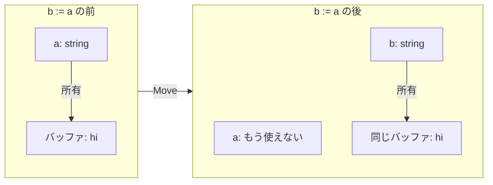
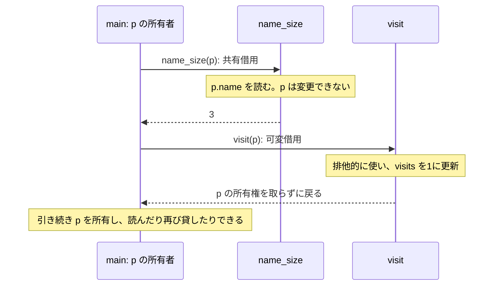
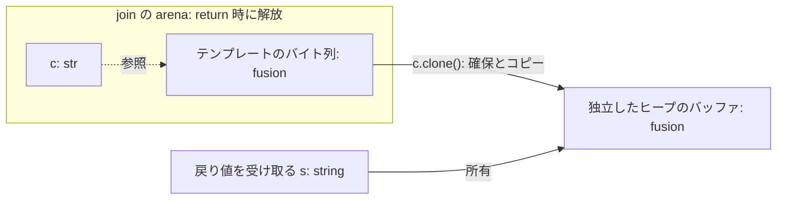

# メモリ: 値、arena、heap

> 🌐 [English](../05-memory.md) · **日本語**

Align にはガベージコレクタも、手動の `free` も、ライフタイム注釈もありません。**データをどこに置くかはプログラマが決め**、所有権は**型の性質**として扱います。コンパイラはライフタイムを推論し、データの解放後に参照が残るプログラムを拒否します。

## 値(既定)

大半のデータは素の値（プレーンな値）として扱われます。数値、`bool`、小さな構造体、スカラー値のみのタプルなどが該当します。これらの値はスタック上に配置され、**Copy** 型として振る舞います。変数への代入や関数の引数として渡すと値がコピーされ、コピー元とコピー先は完全に独立します。動的なメモリ確保（allocation）を行わないため、解放処理も必要ありません。

```align
Point { x: f64, y: f64 }

fn main() -> i32 {
    p := Point { x: 1.0, y: 2.0 }
    q := p              // a copy; p and q are independent
    return 0
}                       // scope ends, values are simply gone
```

構造体が大きくなると、値渡しのコストが無視できなくなります。サイズがキャッシュライン2本分を超えると、コンパイラは警告（`huge struct copy`）を出します。これは、値のコピーの代わりにスライスや arena、あるいは SoA（Structure of Arrays、[11](11-data-oriented.md) 章参照）の利用を検討すべきサインです。

## Move 型 —— 所有権を型に持たせる

ヒープ上のリソースを所有する型（`string`、`array<T>`、`buffer`、`box`、I/O ハンドルなど）は Copy ではなく **Move** 型になります。別の変数に代入すると所有権が移動し、元の変数はその時点で無効（dead）になります。この規則はコンパイラによって厳密に強制されます。

```align
fn main() -> i32 {
    a := "hi".clone()   // a `string` — an owned heap buffer
    b := a              // ownership moves to b
    print(a.len())      // error: use of moved value 'a'
    return 0
}
```

ムーブ後の所有者は1つだけなので、コンパイラはリソースを解放する時点を決められます。所有者がスコープを抜けるとバッファが破棄され、`mut` な所有者に新しい値を代入すると、先に古い値が破棄されます。`string` など複製に対応する型では、`.clone()` で独立したコピーを作れます。ただし、すべての Move 型のリソースを複製できるわけではありません。

所有権を持つフィールド（例えば `name: string`）を含む構造体は、それ自体が自動的に Move 型になり、スコープを抜ける際に再帰的に drop されます。つまり、所有権の性質はデータ構造に従って伝播（合成）します。一方で、そのフィールドの値を読み取る操作（例：`u.name.len()`）は、所有権を消費（ムーブ）することなく、`str` ビューとして安全にデータを借用します。

左右は、同じバッファを `b := a` の前後で見た図です。文字列のバイト列はそのままで、所有者が変わります。



以降、バッファをいつ解放するかは `b` の寿命で決まります。`b := a.clone()` なら、独立したバッファが2つでき、どちらの変数も引き続き使えます。

## 関数に渡す、借りる、更新する

Move 型の `Profile` を通常の引数として渡すと、所有権が関数へ移ります。呼び出し元のレコードを読むだけなら `borrow`、そのレコードを更新するなら `borrow mut` を使います。

```align
Profile { name: string, visits: i64 }

fn name_size(borrow p: Profile) -> i64 = p.name.len()

fn visit(borrow mut p: Profile) {
    p.visits = p.visits + 1
}

fn main() -> i32 {
    mut p := Profile { name: "Ada".clone(), visits: 0 }
    print(name_size(p))    // 3
    visit(p)
    print(p.visits)        // 1
    print(p.name.len())    // 3 — p is still owned here
    return 0
}
```

渡し方は関数の宣言に書き、呼び出しは `visit(p)` のままです。共有借用の関数は `p` をムーブ、置換、破棄できません。可変借用には書き換え可能な値が必要で、呼び出し中は関数が排他的に使います。また、それ以前に取得したビューは無効になるので、更新後に新しいビューを取得します。

必要なのが文字列や配列の要素だけなら、レコード全体を借りずに `str` や `slice<T>` を渡せます。大きな Copy 型の構造体をコピーせずに読みたい場合も、共有の `borrow` が使えます。Copy 型のフィールドの更新を呼び出し元へ反映したい場合は、`borrow mut` が必要です。

この例の2回の呼び出しを追ってみます。どちらも `p` の所有権を渡しません。



この2つの関数の戻り値は整数と Unit です。ビューを返す関数なら、呼び出し後にも `p` への参照が残ることがあります。そのビューも、`p` の寿命と変更に関する規則に従います。

## arena —— ライフタイムでまとめて確保する

ある一連の処理の中で、同じタイミングで不要になる複数の一時データを確保したい場合（例えば、ファイルのパース、リクエストの組み立て、バッチ処理でのデコードなど）は、その処理ブロックを `arena {}` で囲みます。

```align
fn join(a: str, b: str) -> string {
    arena {
        c := template "{a}{b}" // arena-backed temporary
        return c.clone()    // copy the result out — visible escape
    }                       // all arena storage released here
}

fn main() -> i32 {
    s := join("fu", "sion")
    print(s)                // fusion
    return 0
}
```

ここで `c` は、arena に確保したテンプレートの領域を指すビューです。`c.clone()` は独立した文字列の領域を確保し、`join` から戻る前にバイト列をコピーします。



関数から戻ると arena の領域は解放されますが、コピー先のバッファは `s` が所有しています。そちらは `s` が破棄されるときに解放されます。`c` 自体を返すと、呼び出し元に解放済みの領域への参照が残るため、コンパイラが拒否します。`c.len()` のような独立した数値なら、文字列をコピーせずに外へ返せます。

arena は通常、確保済みブロック内のポインタを進めて領域を割り当て、必要に応じて新しいブロックを確保します。arena を抜けると、それらのブロックをまとめて解放します。一時データを1つずつ解放する手間は省けますが、値を作る処理や、ブロック自体の確保と解放には処理量がかかります。

コンパイラはすべての値の **region（有効範囲）** を追跡します。そのため、arena 内で確保された値が、その arena のスコープ外に持ち出されることはありません。

```align
fn leak(a: str, b: str) -> str {
    arena {
        s := template "{a}{b}"
        return s        // error: cannot return a value allocated in an arena
    }                   //        (it is freed at block end)
}
```

region の注釈を書く必要はありません。参照がデータより長く残る場合、コンパイラがエラーを報告します。文字列の例では、`str.clone()` で独立した所有文字列を作れます。ただし、arena 内のすべての値に複製操作があるわけではありません。コレクションを返す場合は、所有権を持つ結果の型と、その領域をどこで確保するかを選びます。

たとえば、関数内の arena で `.to_array()` を呼ぶと、`array<T>` は Move 型でも、その領域は arena に属します。Move は所有権の移動を、有効範囲の推論は領域をいつまで使えるかを決めます。ローカルな arena を持たない補助関数なら、借りた入力から独立した結果を確保できます。呼び出し元の arena は暗黙には引き継がれません。[Little Aligner 15章の Q19](../../little-aligner/ja/15-read-it-four-ways.md)に、スコアの配列を返す例があります。`i64` の要素は独立した値ですが、`str` の配列では、配列自体を所有していても各ビューが借りる領域への依存は残ります。

## heap を、明示的に

`heap.new(x)` は、単一の値を明示的にヒープに確保し（`box`）、それを取り囲む（現在の）arena のライフタイムに紐付けます。確保した値は `.get()` で読み出します。

```align
fn main() -> i32 {
    arena {
        b := heap.new(42)
        print(b.get())      // 42
    }
    return 0
}
```

この構文を書く機会はめったにありません。そして、もし書く必要がない場面で書いてしまった場合はコンパイラが教えてくれます。実は、上記の例は lint 警告の対象になります。

```text
warning: unnecessary heap allocation: this box is only ever read back with
         `.get()` and never escapes — use the value directly (a stack value
         suffices)
```

上の警告は、この box が `.get()` で読み戻されるだけなので、値を直接使えばよいことを示しています。`heap.new` は、値を作ったスタックフレームよりも長く保持し、かつ特定の arena 内に置きたいときに使います。それ以外では、値や arena 内のコレクションを使います。

## ビュー: `str` と `slice<T>`

`str` は文字列データの借用ビューであり、`slice<T>` は配列の借用ビューです。ビュー自体は非常に軽量な Copy 型（ポインタと長さのペア）ですが、**それが指し示すデータの region（有効範囲）** に関する情報を保持しています。そのため、arena 内のデータを指すビューは arena の外へ持ち出せず、構造体のフィールドを指すビューはその構造体よりも長生きすることはできません。ここでも推論と規則は同じであり、ライフタイムの注釈は一切不要です。

```align
fn main() -> i32 {
    xs := [10, 20, 30, 40]
    s := xs[1..3]           // slice view: elements 1 and 2, no copy
    print(s.sum())          // 50
    return 0
}
```

## 判断の手順

これでメモリ管理のルールのすべてです。データを作成する際は、たった1つのこと、「*そのデータのライフタイムは何か？*」だけを考えてください。

- この式、あるいはこのスコープ内で不要になる → **値（Value）**。特別なことは何もしません。
- 一連の処理の終わりにまとめて不要になる → **arena**。スコープ外でも使い続けたいデータだけ `.clone()` でコピーして外に出します。
- 現在の関数フレームよりも長生きさせるべき単一の値 → 適切なライフタイムを持つ arena 内で **`heap.new`** を使います。
- 既存のデータを読むだけ → **ビュー**（`str`、`slice`）。メモリ確保や参照先のデータのコピーは行いません。

これ以外のすべて —— メモリをいつ解放するか、データがエスケープしているか、誰がどの所有権を持っているか —— を追跡・推論するのはコンパイラの仕事です。これらはすべてコンパイル時に検査され、ソースコード上に余計な注釈を書く必要はありません。ただし、コード上で明示的に「目に見える」ポイントがいくつかあります。ライフタイムの開始と終了を示す `arena {}`（および名前付きの `arena r {}`）ブロック、明示的なコピーのコストを支払う `.clone()` の呼び出し、そして所有していない値を関数が読み取り／更新する `borrow` / `borrow mut` パラメータです。
