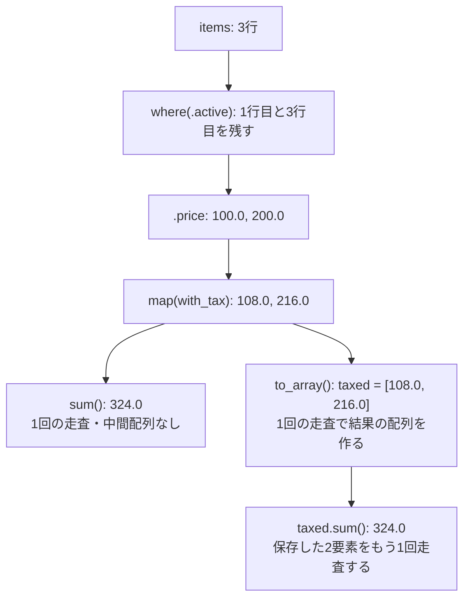

# パイプライン ― データ処理の中核

> 🌐 [English](../06-pipelines.md) · **日本語**

ここが Align の心臓部です。手動でループを書く代わりに、コレクションに対する変換処理をステージごとに記述することで、コンパイラが自動的にループを生成します。生成されるループは単一のパスに融合（fuse）され、分岐を最小限に抑えた、ベクトル化可能な形式になります。この章では、パイプライン処理で使用できる操作をひと通り紹介します。

## 全体の形

```align
total := prices.map(with_tax).where(in_stock).sum()
```

左から右へ読むと、`prices` の各要素を変換し、条件に合うものを残して合計しています。`map`、`where`、`sum` は1つのループに融合され、変換した値をすぐ次の処理へ渡すため、**中間配列を作りません**。

パイプラインは必ず**終端しなければなりません**。終端とはリダクション（`sum`、`count`、`reduce` など）か、実体化（`to_array`、`map_into`）のことです。終端を持たないパイプライン（例：`xs.map(f)` のまま放置すること）はコンパイルエラーになります。遅延評価される状態をそのまま持ち回すと、どこで計算コストが発生するかが隠れてしまうためです。

> **コスト:** 融合されたリダクションは O(n) で、中間コレクションを確保しません。`to_array` が結果領域を確保するのは最大1回です（`where` がある場合は入力の長さを上限とします）。`map_into` は呼び出し側が用意した領域へ書き込むため、メモリを確保しません。

## 変換ステージ

```align
xs.map(f)          // transform each element
xs.where(p)        // keep elements where p holds
xs.where(.active)  // field shorthand: keep rows whose bool field is true
xs.price           // field projection: array<Item> → the price of each
xs.scan(0, add)    // running accumulation — a stage, not a terminal
```

ステージに渡すのは名前付き関数か、インラインのラムダです。ラムダは `fn x { x * 2 }` のように、パラメータを波括弧の前に書きます。(ラムダは周囲の値もキャプチャできます。詳しくは [10](10-closures-and-parallelism.md) 章で扱います。)

## `zip` で複数の入力を読む

複数の配列やスライスの同じ位置にある要素から、1つの結果を作るには `zip` を使います。

```align
fn combine(a: slice<f32>, b: slice<f32>, c: slice<f32>, out dst: slice<f32>) {
    zip(a, b, c)
        .map(fn v { v.0 + v.1 * v.2 })
        .map_into(dst)
}
```

`zip` はタプルの配列を作らず、パイプラインの入力をまとめます。すべての入力は同じ長さである必要があり、反復処理の前に検査されます。各 `v` は、その位置の要素をまとめた一時的な SSA（静的単一代入形式）のタプルです。現在は、Copy なプリミティブスカラーを要素とする2つ以上の配列・スライスに対応しています。入力同士が同じ領域を参照していても構いませんが、`map_into` の出力先はどの入力領域とも重なってはいけません。

## リダクション終端

```align
xs.sum()                              // add everything
xs.count()                            // how many survived the stages
xs.min()   /  xs.max()                // extrema
xs.any(p)  /  xs.all(p)               // bool: does any / do all satisfy p
xs.reduce(init, f)                    // the general fold — init FIRST, then fn acc, x
```

```align
fn main() -> i32 {
    xs := [1, 2, 3, 4]
    print(xs.reduce(1, fn acc, x { acc * x }))       // 24 — product
    print(xs.scan(0, fn acc, x { acc + x }).max())   // 10 — max prefix sum
    print(xs.map(fn x { x * x }).sum())              // 30
    return 0
}
```

## 並べ替えと分割

```align
fn main() -> i32 {
    xs := [10, 21, 32, 3]
    sorted := xs.sort_by_key(fn x { -x })            // descending: negate the key
    print(sorted[0])                                 // 32

    (evens, odds) := [1, 2, 3, 4, 5].partition(fn x { x % 2 == 0 })
    print(evens.count())                             // 2
    print(odds.sum())                                // 9
    return 0
}
```

`sort()` は昇順にソートし、`sort_by_key(f)` は計算したキーでソートします。`partition(p)` は 1 パスで 2 つの所有配列に分割します。条件を満たす要素、続いてそれ以外です。

現時点でどちらのソートもスカラ専用で、これが構造体の `array<Item>` を扱うときの落とし穴になります。構造体要素に対する `sort` / `sort_by_key` はそのまま拒否され（`'sort' over struct elements is not supported yet (project a field first)`）、`sort_by_key` のキーも順序付け可能なスカラ（整数、浮動小数点数、`char`、`str`）でなければなりません。並べ替えたいフィールドを先に射影してください。

> **コスト:** どちらのソートも安定ソートで、最悪計算量は O(n log n) です。所有権を持つ結果を生成し、追加の作業領域は最悪 O(n) です。`sort_by_key` はキー関数を入力順に、各要素につきちょうど1回評価します。これらの保証を保つ範囲で、内部のマージ方式が変わることはあります。

## チャンク分割（一定サイズの切り出し）

`chunks(n)` は連続する窓をスライスとして順に取り出します(最後だけ短くなることがあります)。バッチ処理の典型的な形です。

```align
fn per_chunk(xs: slice<i64>) -> i64 = xs.sum()

fn main() -> i32 {
    xs := [1, 2, 3, 4, 5]
    sums := xs.chunks(2).map(per_chunk).to_array()   // [3, 7, 5]
    print(sums.sum())                                // 15
    return 0
}
```

## 実体化（マテリアライズ） ― `to_array` と `map_into`

ほとんどのパイプラインはリダクションで終わり、いっさいメモリ確保をしません。それでも変換後のコレクションそのものが欲しいときは、その意図を明示します。

```align
big := xs.map(fn x { x * 10 }).where(fn x { x > 20 }).to_array()   // owned array<i64>
```

書き込み先がすでに存在する場合は、そこへ直接書き込みます。メモリ確保はゼロで、しかもコンパイラが「入力元と書き込み先がエイリアスしない」ことを証明します。

```align
fn dbl(x: i64) -> i64 = x * 2

fn scale(src: slice<i64>, out dst: slice<i64>) {
    src.map(dbl).map_into(dst)      // lengths must match; checked
}

fn main() -> i32 {
    xs := [1, 2, 3, 4]
    mut ys := [0, 0, 0, 0]
    mut d: slice<i64> := ys
    scale(xs, d)
    print(ys.sum())                 // 20
    return 0
}
```

パラメータに付いた `out` マーカーに注目してください。スライス越しに書き込む関数は、そのことをシグネチャで宣言します。ミューテーションも含め、何ひとつ隠しません。

## 実例で見る

構造体の配列に対して、在庫のある商品の税込価格を合計してみましょう。

```align
Item { price: f64, active: bool }

fn with_tax(p: f64) -> f64 = p * 1.08

fn main() -> i32 {
    items := [
        Item { price: 100.0, active: true },
        Item { price: 50.0,  active: false },
        Item { price: 200.0, active: true },
    ]
    total := items.where(.active).price.map(with_tax).sum()
    print(total)                    // 324.0
    return 0
}
```

融合されたループでは、`where(.active)` が行を選び、`.price` が価格を読み、`with_tax` が変換し、`sum` が合計します。`alignc emit-llvm` で生成されたループを確認し、使っているターゲットと最適化プロファイルでベクトル化されるか調べられます。

この例の終端を2通りで比べると、次のようになります。`.price` と `map` に書いた数値は、ループの中で次の操作へ渡す値です。`to_array()` を選んだ経路では、結果を `taxed` という配列に保存します。その後の `taxed.sum()` は、この配列を別途走査します。



## 処理を融合する利点

処理を段階ごとに分けると、同じメモリを何度も走査したり、中間配列を確保したりすることがあります。融合によって各段階を1本のループにまとめれば、中間配列は不要になります。ループの範囲が分かり、参照先の重なりがないことも、LLVM のベクトル化に役立ちます。生成されたコードは `emit-llvm` で確認できます。

## `loop` と `group_by` を使う場面

反復のたびに続行するかどうかを決める処理には `loop` を使います。EOF までの読み込み、バックオフを伴うリトライ、ステートマシンなどが該当します（[02 章](02-language-basics.md)）。グループごとの集計には `group_by` を使います（[11 章](11-data-oriented.md)）。`loop` で配列をインデックス順に走査する前に、パイプラインで同じ変換を表せるかを確認してください。
